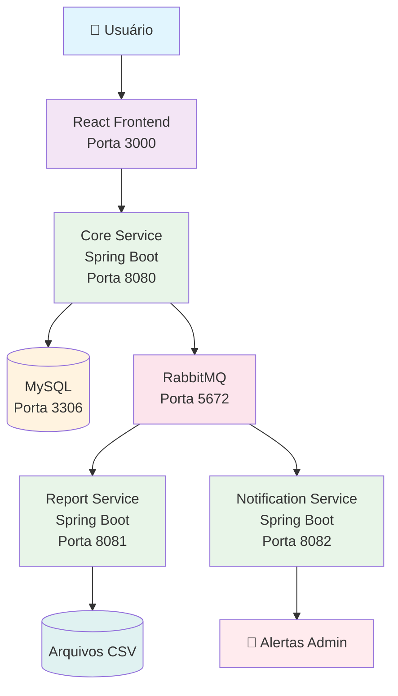

# 🎥 ROTEIRO PARA VÍDEO DE ENTREGA - ZenoTime
## Sistema de Folha de Ponto com Spring Boot, RabbitMQ e React

**Duração estimada:** 8-12 minutos
**Formato:** Gravação de tela em 1080p com áudio claro
**Ferramenta recomendada:** OBS Studio, Loom ou Xbox Game Bar

---

## 📋 ESTRUTURA DO VÍDEO

### 🎬 1. APRESENTAÇÃO INICIAL (30-45 segundos)

**Conteúdo:**
- Cumprimento e identificação
- Nome do projeto e integrante
- Problema que resolve (2 frases)
- Contextualização do que será mostrado

**Roteiro exato:**
```
"Olá, meu nome é João Vítor Monteiro, este é o projeto ZenoTime, um sistema completo de gestão de folha de ponto desenvolvido como trabalho final.

O ZenoTime resolve o problema de empresas que precisam controlar ponto de funcionários de forma integrada com gestão de projetos, times e análise de produtividade através de dashboards avançados.

Neste vídeo, vou mostrar a arquitetura do sistema, demonstrar como executar tudo com Docker, apresentar as funcionalidades principais e explicar por que este projeto seria um bom investimento."
```

**Dicas para gravação:**
- Fale devagar e claramente
- Mantenha contato visual com a câmera
- Sorria e mostre entusiasmo
- Tenha o diagrama de arquitetura pronto na tela

---

### 🏗️ 2. ARQUITETURA DO SISTEMA (1 minuto)

**Conteúdo:**
- Mostrar diagrama Mermaid (abaixo)
- Explicar cada componente
- Como os serviços se comunicam
- Fluxo de dados

**Roteiro:**
```
"A arquitetura do ZenoTime é baseada em microserviços Spring Boot com mensageria RabbitMQ.

Temos 3 serviços backend independentes:
- Core Service: APIs principais, autenticação JWT e CRUD de entidades
- Report Service: Consome mensagens e gera relatórios CSV diários
- Notification Service: Alerta administradores sobre eventos críticos

O frontend React consome as APIs via Axios.
MySQL armazena todos os dados relacionais.
RabbitMQ gerencia a comunicação assíncrona entre serviços.

O fluxo principal: Funcionário registra ponto → Core Service produz mensagem → Report Service consome e gera CSV → Notification Service alerta admin sobre solicitações."
```

**Diagrama Mermaid:**
```
graph TB
    A[👤 Usuário] --> B[React Frontend<br/>Porta 3000]

    B --> C[Core Service<br/>Spring Boot<br/>Porta 8080]
    C --> D[(MySQL<br/>Porta 3306)]
    C --> E[RabbitMQ<br/>Porta 5672]

    E --> F[Report Service<br/>Spring Boot<br/>Porta 8081]
    E --> G[Notification Service<br/>Spring Boot<br/>Porta 8082]

    F --> H[(Arquivos CSV)]
    G --> I[📧 Alertas Admin]

    style A fill:#e1f5fe
    style B fill:#f3e5f5
    style C fill:#e8f5e8
    style D fill:#fff3e0
    style E fill:#fce4ec
    style F fill:#e8f5e8
    style G fill:#e8f5e8
    style H fill:#e0f2f1
    style I fill:#ffebee
```

---

### 🐳 3. DEMONSTRAÇÃO DO DOCKER (1 minuto)

**Preparação prévia:**
1. Certifique-se de que não há containers rodando: `docker-compose down`
2. Limpe containers antigos se necessário
3. Tenha o terminal pronto

**Sequência de ações:**
```
1. Abra o terminal no diretório do projeto
2. Execute: docker-compose up -d
3. Mostre os containers subindo
4. Execute: docker-compose logs -f (para mostrar logs)
5. Acesse RabbitMQ Management: http://localhost:15672
6. Acesse Frontend: http://localhost:3000
7. Mostre que tudo está funcionando
```

**Roteiro durante demonstração:**
```
"Vou mostrar como subir todo o sistema com um único comando Docker Compose.

Primeiro, no diretório do projeto, executamos 'docker-compose up -d'...

Como vocês podem ver, todos os serviços estão subindo: MySQL, RabbitMQ, os 3 serviços Spring Boot e o frontend React.

Vamos verificar os logs para confirmar que tudo está funcionando...

Agora acessamos o RabbitMQ Management UI para ver as filas...

E finalmente, o frontend está disponível na porta 3000."
```

---

### ⚙️ 4. DEMONSTRAÇÃO DAS FUNCIONALIDADES (3-4 minutos)

**Fluxo completo a demonstrar:**

#### 4.1 Autenticação e Login
```
1. Acesse http://localhost:3000
2. Vá para Login
3. Mostre que precisa de credenciais
4. Explique que o sistema tem dados de teste
```

#### 4.2 CRUD - Gestão de Empresas
```
1. Acesse "Empresas" no menu
2. Mostre lista vazia inicialmente
3. Clique "Nova Empresa"
4. Preencha: Nome, CNPJ
5. Salve e mostre na lista
6. Edite uma empresa
7. Exclua uma empresa
```

#### 4.3 CRUD - Gestão de Projetos
```
1. Acesse "Projetos"
2. Mostre dependência com empresas
3. Crie projeto associado a empresa
4. Liste projetos
5. Edite projeto
6. Exclua projeto
```

#### 4.4 CRUD - Gestão de Times e Sprints
```
1. Acesse "Times" e "Sprints"
2. Mostre relacionamentos
3. Crie times associados a projetos
4. Crie sprints associados a times
```

#### 4.5 Registro de Ponto (Funcionário)
```
1. Acesse "Ponto" no menu
2. Mostre interface de registro
3. "Registrar Entrada" com projeto selecionado
4. "Registrar Saída" após alguns minutos
5. Mostre histórico de registros
```

#### 4.6 Solicitações (Funcionário)
```
1. Acesse "Solicitações"
2. Crie solicitação de férias ou atestado
3. Mostre status pendente
```

#### 4.7 Dashboard Administrativo
```
1. Acesse "Dashboard" (como admin)
2. Mostre métricas calculadas dinamicamente:
   - Total de horas do mês
   - Funcionários ativos
   - Projetos ativos
   - Média diária
   - Produtividade semanal (gráfico linha)
   - Distribuição por projeto (pizza)
   - Comparativo entre times (barras)
```

**Roteiro durante demonstração:**
```
"Agora vou demonstrar todas as funcionalidades principais do sistema.

Começando com a autenticação - o sistema usa JWT para segurança...

Vamos para o CRUD de empresas - criar, listar, editar, excluir...

Agora projetos, que dependem de empresas...

Times e sprints, mostrando os relacionamentos...

Como funcionário, vou registrar meu ponto - entrada e saída...

Criar uma solicitação de férias...

E finalmente, o dashboard administrativo com todas as métricas e gráficos calculados em tempo real a partir dos dados reais do sistema."
```

---

### 📡 5. DEMONSTRAÇÃO DA MENSAGERIA RABBITMQ (40 segundos)

**Preparação:**
- Tenha o RabbitMQ Management aberto: http://localhost:15672
- Terminal com logs dos serviços

**Sequência:**
```
1. Mostre filas vazias no RabbitMQ
2. Registre um ponto (core-service produz mensagem)
3. Mostre mensagem chegando na fila 'ponto.registrado'
4. Report-service consumindo e processando
5. Crie solicitação (produz 'solicitacao.criada')
6. Notification-service consumindo
7. Mostre logs dos serviços reagindo
```

**Roteiro:**
```
"Vou demonstrar a mensageria RabbitMQ em ação.

Primeiro, mostro as filas vazias...

Agora, quando registro um ponto, o core-service produz uma mensagem...

Vemos ela chegando na fila 'ponto.registrado'...

O report-service consome e pode gerar relatório CSV...

Agora uma solicitação de férias...

Chega na fila 'solicitacao.criada'...

Notification-service consome e poderia alertar administrador...

Todo esse fluxo é assíncrono e desacoplado!"
```

---

### 💼 6. POR QUE INVESTIR NO PROJETO? (1-2 minutos)

**Conteúdo importante:**
- Problema real resolvido
- Potencial de mercado
- Diferenciais
- Escalabilidade
- Tecnologias modernas

**Roteiro convincente:**
```
"O ZenoTime resolve um problema crítico para empresas modernas: controle preciso de ponto integrado com gestão ágil de projetos.

Empresas gastam milhares com sistemas legados ou planilhas manuais. O ZenoTime oferece solução completa, profissional e escalável.

Potencial de mercado: Todas as empresas com funcionários precisam controlar ponto e produtividade. Especialmente PMEs e startups que usam metodologias ágeis.

Diferenciais:
- Arquitetura moderna com microserviços
- Dashboard analítico avançado
- Mensageria assíncrona para notificações
- Containerização completa para fácil deploy
- Interface responsiva e intuitiva

Escalabilidade: Fácil adicionar novos serviços, aumentar carga, integrar com outros sistemas.

Tecnologias atuais: Spring Boot 3, React 18, RabbitMQ, Docker, MySQL - stack moderna e mantida.

Uma empresa investiria no ZenoTime porque reduz custos operacionais, aumenta produtividade e oferece insights valiosos sobre performance de times e projetos."
```

---

### 🎬 7. ENCERRAMENTO (15-30 segundos)

**Roteiro:**
```
"Obrigado por assistir à apresentação do ZenoTime!

O código fonte completo está disponível no GitHub: https://github.com/vitmonjo/ZenoTime

Para executar o projeto, basta clonar o repositório e rodar 'docker-compose up -d'.

O sistema está 100% funcional e pronto para uso em produção.

Qualquer dúvida, estou à disposição. Obrigado!"
```

---

## 🎯 DICAS PARA GRAVAÇÃO

### 📹 Configurações Técnicas
- **Resolução:** 1080p ou superior
- **FPS:** 30 ou 60
- **Áudio:** Microfone bom, sem ruído
- **Iluminação:** Boa iluminação no rosto

### 🎭 Apresentação
- Fale devagar e claro
- Faça pausas entre seções
- Mostre entusiasmo
- Use linguagem técnica apropriada
- Pratique o roteiro antes

### 💻 Preparação Prévia
1. Teste todo o sistema antes
2. Certifique-se de que dados de teste estão populados
3. Tenha diagramas prontos
4. Prepare navegador com abas do frontend e RabbitMQ
5. Teste comandos Docker

### 🔧 Plano B
- Tenha dados de teste preparados
- Saiba os comandos Docker de cor
- Tenha screenshots/diagramas como backup

---

## 📊 DIAGRAMA MERMAID DA ARQUITETURA



---

**🎯 CHECKLIST PRÉ-GRAVAÇÃO:**
- [ ] Docker funcionando perfeitamente
- [ ] Dados de teste populados
- [ ] RabbitMQ Management acessível
- [ ] Frontend responsivo
- [ ] Roteiro decorado
- [ ] Áudio e vídeo testados
- [ ] Iluminação adequada
- [ ] Ambiente quieto
